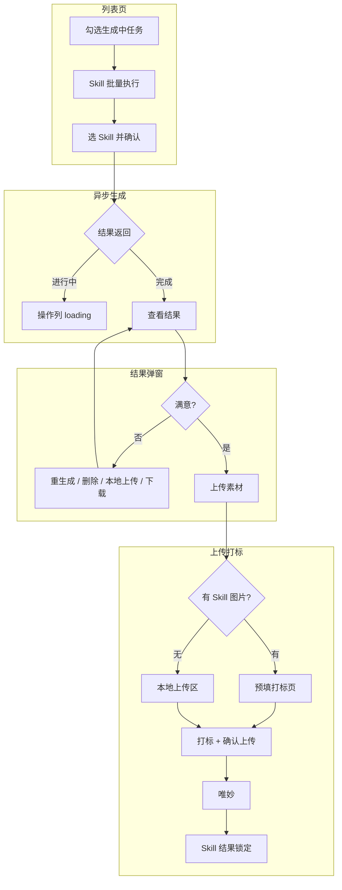

# 产品设计文档：AI 生产平台 Skill 批量应用

> **文档定位**：面向产品、设计、业务同学的**易读版**说明。  
> **技术细节与验收条款**请参阅：[产品迭代需求-AI生产平台Skill批量应用.md](./产品迭代需求-AI生产平台Skill批量应用.md)（PRD v1.3）  
> **原型预览**：本地静态页 `index.html`（当前为 Mock 数据）

| 项目 | 内容 |
|------|------|
| 文档版本 | v1.0 |
| 对应 PRD | v1.3 |
| 更新日期 | 2026-06-09 |

---

## 阅读指引

| 你是谁 | 建议阅读 |
|--------|----------|
| 产品 / 业务 | 全文，重点看 **§四 用户旅程**、**§八 待决策** |
| 交互 / 视觉 | **§五 页面说明**、**§六 交互细则**、**§七 文案** |
| 研发 | 本文了解意图，接口与数据模型以 PRD §10.7、§10.8 为准 |

---

## 一、一句话说明

在**现有创意生产任务列表页**上，让设计师可以**批量勾选任务、选一个 Skill、异步生成多张成品**，在弹窗里逐张筛选/替换，满意后走**原有上传打标 → 唯妙**链路——**不新建页面、不改 Valet、不做 Prompt 编辑**。

---

## 二、为什么要做

### 现状痛点

- 广告策略团队已在 **Skills Hub** 沉淀平面/视频类 Skill，设计师目前在 **Valet** 上使用。
- Valet 适合**少量、灵活**生产，但**不稳定**，难以承接**大批量**外投创意任务。
- 选品 → 下单 → 生产的链路已在「创意任务平台 → AI 生产平台 → 唯妙」跑通，缺的是**在列表页批量调 Skill** 的能力。

### 本期要解决什么

1. **批量生产**：一次选多个「生成中」任务，统一执行同一个 Skill。  
2. **集中看结果**：每条任务在操作列查看 N 张生成图（或故事版文件），逐张处理。  
3. **不满意可换**：单张重新生成、删除、或本地上传替换，**不用写 Prompt**。  
4. **满意就上传**：走现有打标弹窗，确认后自动上传唯妙。

### 本期 deliberately 不做什么

- 不做 Prompt 编辑 / 调试  
- 不做设计师在平台内的精细改稿（仍用 Valet 或线下工具）  
- 不改造 Valet 本身  
- 取消「图创作」入口  
- 不单独新建 Skill 生产页  

---

## 三、谁在用

| 角色 | 能做什么 | 不能做什么 |
|------|----------|------------|
| **UED 设计师** | 批量执行 Skill、看结果、上传打标 | — |
| **已分配 OA 设计师** | 同上 | — |
| **AIGC 设计师** | 现网任务操作 | **看不到** Skill 批量相关按钮与结果入口 |
| **策略团队（Skills Hub）** | 维护 Skill 配置 | 不在本页生产 |

---

## 四、核心用户旅程

### 旅程 A：平面单图 — 从批量生产到上传唯妙

> 典型任务：字节渠道、单品单图、状态「生成中」

```
① 接单（现网）
      ↓
② 在列表勾选 1 条或多条「生成中」任务
      ↓
③ 点击「Skill 批量执行」→ 在弹窗里选渠道 / 生成类型 / Skill → 确认执行
      ↓
④ 等待生成（可离开页面；操作列出现 loading）
      ↓
⑤ 生成完成后，操作列出现「查看结果」→ 打开结果弹窗
      ↓
⑥ 逐张处理：满意保留 / 不满意 → 重新生成、删除、或本地上传替换
      ↓
⑦ 点击「上传素材」
      ├─ Skill 有图片 → 自动带进打标页
      └─ 没有图片   → 正常点击上传本地文件
      ↓
⑧ 打标（与现网一致）→ 确认上传 → 自动进唯妙
      ↓
⑨ 完结（Skill 结果锁定，不可再改）
```

### 旅程 B：实拍视频 — 故事版 Skill

> 典型任务：实拍视频类，执行「生成故事版 skill」

```
①～⑤ 同旅程 A
      ↓
⑥ 结果弹窗展示的是 Excel 分镜表（不是图片）
      → 可下载、删除、重新生成
      → **不会**自动进入「上传素材」的图片预填
      ↓
⑦ 点击「上传素材」→ 走**正常本地上传**（如上传视频成片等）
      ↓
⑧ 打标上传唯妙（故事版 Excel 如何进下游系统 — **待产品定义**）
```

### 旅程 C：不用 Skill，直接上传

> Skill 与上传是**弱耦合**的：没跑 Skill、或只有故事版、或图还在生成中，都可以点「上传素材」

```
点击「上传素材」→ 正常上传区 → 本地上传 → 打标 → 唯妙
```

### 旅程 D：上传后仍不满意

```
在唯妙或本地用 Valet / PS 等改稿
      ↓
走现网「重新上传」流程（Skill 结果已锁定时的正式重传规则 — **待产品定义**）
```

---

## 五、页面与模块说明

改造范围：**仅在任务列表页增量**，不新开 Tab、不新开站点。

### 5.1 列表页 · 批量操作区

**位置**：表头左侧，与「分配设计师」「批量开始生产」等并列。

| 元素 | 说明 |
|------|------|
| **Skill 批量执行** | 新建按钮；勾选任务后出现 |
| 显示条件 | 已勾选 ≥1 条任务，且其中存在「生成中」的**非 AIGC** 任务 |
| 与「批量开始生产」 | **完全独立**，互不替代 |


> **备选方案（未实现）**：把渠道 / 生成类型 / Skill 下拉常驻在列表页顶部。当前原型放在弹窗内，见 §八。

---

### 5.2 Skill 批量执行弹窗

**触发**：点击「Skill 批量执行」。

```
┌──────────────── Skill 批量执行 ────────────────┐
│  已勾选 N 条任务，其中 M 条可执行 Skill          │
│                                                  │
│  渠道筛选      [ 全部渠道 ▼ ]                    │
│  生成类型筛选  [ 全部类型 ▼ ]                    │
│  选择 Skill    [ 请选择 Skill ▼ ]                │
│                                                  │
│  （底部提示文案，如：将对 M 条任务执行「xxx」）   │
│                                                  │
│            [ 取消 ]    [ 确认执行 ]              │
└──────────────────────────────────────────────────┘
```

**筛选逻辑（用户可感知规则）**

- 渠道选项：**字节、腾讯、小红书**（任务里的「抖音」会映射为字节，「微信/VTD」映射为腾讯）
- 生成类型：**单品单图、实拍视频**（任务的「单品单视频」等会映射为实拍视频）
- Skill 列表：只显示**与当前筛选匹配**的 Skill；不匹配的**直接隐藏**（不置灰）
- **一次批量只能选一个 Skill**
- 可先勾选任务再打开弹窗选 Skill，顺序不限

**当前 Mock 可选 Skill（联调前参考）**

| Skill 名称 | 适用 | 每条任务产出 |
|------------|------|--------------|
| 大平台logo上身版型鉴 | 字节/腾讯 · 单品单图 | 3 张图 |
| 抖音图文原生实拍风 | 字节/小红书 · 单品单图 | 2 张图 |
| 实拍视频快剪 | 全渠道 · 实拍视频 | 2 张图 |
| VIP广告创意生成器 | 全渠道 · 单图+视频 | 2 张图 |
| 生成故事版skill | 全渠道 · 实拍视频 | 1 个 Excel |

---

### 5.3 列表页 · 操作列（生成中任务）

**非 AIGC 设计师 · 生成中** 时，操作列固定有：

| 按钮 | 说明 |
|------|------|
| **上传素材** | 始终可点（弱耦合 Skill，见 §6.3） |
| **关闭** | 现网能力 |
| **查看结果** / **loading** | 仅当该任务已触发 Skill 时出现，紧挨在「关闭」右侧 |

**Skill 入口状态**

| 状态 | 操作列右侧展示 |
|------|----------------|
| Skill 生成中（还有图没回来） | 转圈 loading |
| 已有可查看结果 | 文字链「查看结果」 |
| 未执行 Skill | 无额外入口 |

**已取消**：「图创作」按钮；操作列不展示素材名称、不展示「N 张待处理」计数文案（是否恢复见 §八）。

---

### 5.4 Skill 结果处理弹窗

**触发**：操作列「查看结果」。

**弹窗头部信息**：任务号、所用 Skill 名称、触发时间、一行操作提示。

**内容区**：网格卡片，每张结果独立一块。

#### 图片类结果

```
┌─────────────┐
│   [预览图]   │  状态角标：生成中 / 待处理 / 已替换
├─────────────┤
│ 下载 │ 删除 │ 本地上传 │ 重新生成 │
└─────────────┘
```

| 操作 | 用户理解 |
|------|----------|
| **下载** | 保存到本地，可拿去 Valet 改 |
| **删除** | 这张不要了（当前无二次确认） |
| **本地上传** | 用本地图片替换这张 AI 图 |
| **重新生成** | 再用同一个 Skill 生成一张新的替换 |

> **重要**：结果**不会自动上传唯妙**。上传发生在下一步「上传素材」弹窗里。

#### 故事版类结果

```
┌─────────────┐
│  📊 Excel   │  故事版示例 / 文件名
├─────────────┤
│ 下载故事版 Excel │ 删除 │ 重新生成 │
└─────────────┘
```

- 点击卡片或下载按钮 → 下载分镜表 Excel  
- **不会**出现在后续「上传素材」的图片预填里  

---

### 5.5 上传素材弹窗（与 Skill 弱耦合）

**触发**：操作列「上传素材」。

| 进入时的情况 | 用户看到什么 |
|--------------|--------------|
| Skill 已返回**图片**（待处理/已替换状态） | **图片打标页**，Skill 图已预填好 |
| 无 Skill / 还在生成 / 只有故事版 Excel | **正常点击上传区** |
| 已上传过唯妙（Skill 锁定） | 打不开，提示走重新上传 |

**打标页额外能力**

- 预填了 Skill 图时，仍可通过「继续上传」**追加本地文件**  
- 打标、批量解析、确认上传 — **与现网完全一致**  
- 确认上传 → 自动进唯妙 → **Skill 结果锁定**（结果弹窗变只读，仅可下载）

**素材数量**

- 全部是 Skill 预填图时：可不校验任务要求的素材条数  
- 混有本地上传时：仍校验任务 `materialQuantity`  

---

## 六、关键交互细则（场景问答）

### 6.1 批量执行

**Q：最少要勾选几条任务？**  
A：原型为 **≥1 条**；早期 PRD 写过 ≥2，**待统一**。

**Q：能同时对「待生产」和「生成中」的任务执行 Skill 吗？**  
A：不能。只对勾选里处于**「生成中」且非 AIGC** 的任务生效；弹窗会提示可执行条数。

**Q：一次能选多个 Skill 吗？**  
A：不能，一次批量 = 一个 Skill。

**Q：生成中可以关掉页面吗？**  
A：可以离开（设计为异步）。回来后在操作列看 loading / 查看结果即可。（注：当前原型刷新会丢数据，正式环境需后端持久化。）

---

### 6.2 结果处理

**Q：每张图都要点「确认」才能上传吗？**  
A：**当前原型：不需要。** 待处理/已替换的图片，点「上传素材」时会自动预填。  
早期 PRD 有过「确认提交」第一级预选 — **是否恢复待产品拍板**。

**Q：重新生成会换 Skill 吗？**  
A：不会，**沿用本任务上次执行的 Skill**。

**Q：上传唯妙之前，结果还能改吗？**  
A：能。删除、本地上传替换、重新生成都可用。

**Q：上传唯妙之后呢？**  
A：Skill 结果**锁定**，不可再删改，只能下载查看。

---

### 6.3 上传素材（弱耦合）

**Q：没跑 Skill 能上传吗？**  
A：**能**，走正常本地上传。

**Q：Skill 还在转圈能上传吗？**  
A：**能**，走正常本地上传；已回来的 Skill 图会在下次打开时预填。

**Q：只有故事版 Excel，点上传素材会怎样？**  
A：进入**正常上传区**，不会把 Excel 当图片预填。

**Q：Skill 图 + 本地文件能一起传吗？**  
A：**能**，预填 Skill 图后可用「继续上传」追加本地文件。

---

### 6.4 权限

**Q：AIGC 设计师能看到 Skill 按钮吗？**  
A：**不能**，批量执行与结果入口均不展示。

---

## 七、文案规范（设计稿请直接引用）

| 场景 | 文案 |
|------|------|
| 批量入口按钮 | Skill 批量执行 |
| 批量弹窗标题 | Skill 批量执行 |
| 弹窗内 Skill 下拉标签 | 选择 Skill |
| 弹窗主按钮 | 确认执行 |
| 操作列 Skill 入口 | 查看结果 |
| Skill 生成中 | （loading 图标，无文字） |
| 图片操作 | 下载、删除、本地上传、重新生成 |
| 故事版操作 | 下载故事版 Excel、删除、重新生成 |
| 上传按钮 | 上传素材 |
| 有预填图时弹窗标题 | 图片打标 |
| 结果弹窗底部 | 关闭 |
| 已锁定提示 | 该任务已上传唯妙，请通过重新上传流程处理新素材 |

---

## 八、待你决策的事项（接续优化清单）

以下事项在 PRD 中已有记录，此处按**产品优先级**浓缩，便于评审拍板。

### P0 — 影响主流程定稿

| # | 问题 | 选项 A | 选项 B |
|---|------|--------|--------|
| 1 | 结果要不要「确认提交」预选？ | 维持原型：无预选，上传时自动带入待处理图 | 恢复两级：先在结果弹窗点「确认提交」，再上传 |
| 2 | 故事版 Excel 交付链路 | 仅下载，设计师线下使用 | 定义如何同步唯妙 / 视频下游 |

### P1 — 影响体验一致性

| # | 问题 | 说明 |
|---|------|------|
| 3 | Skill 筛选放哪？ | 弹窗内（现状） vs 列表页顶部常驻 |
| 4 | 批量最低条数 | ≥1（现状） vs ≥2 |
| 5 | 操作列是否显示「N 张待处理」 | 现状仅 loading / 查看结果 |

### P2 — 联调与健壮性

| # | 问题 |
|---|------|
| 6 | 删除是否要二次确认 |
| 7 | 单张生成失败 / 超时的界面与重试 |
| 8 | 50 条批量的排队提示与 SLA |
| 9 | 上传唯妙后的正式「重新上传」流程 |
| 10 | Skills Hub 字段与接口对齐（研发联调） |

---

## 九、与现网的变化对照

| 项目 | 改前 | 改后 |
|------|------|------|
| 图创作 | 生成中有入口 | **移除** |
| 批量 Skill | 无 | **新增**「Skill 批量执行」 |
| 结果查看 | 无 | **新增**结果弹窗 + 操作列入口 |
| 上传素材 | 仅本地上传 | **有 Skill 图则预填**，无图则不变 |
| Prompt | Valet 承担 | 生产平台**仍不提供** |
| 精细改稿 | Valet / 线下 | **不变** |

---

## 十、端到端流程图



---

## 十一、名词速查

| 名词 | 一句话 |
|------|--------|
| **Skill** | 策略团队封装的 AI 生成能力包，在 Skills Hub 注册 |
| **Skills Hub** | Skill 的管理后台 |
| **Valet** | 设计师写 Prompt、灵活单张生产的工具 |
| **AI 生产平台** | 本需求改造的「创意生产平台」列表页 |
| **唯妙创意** | 素材最终投放管理端 |
| **弱耦合上传** | 上传不强制依赖 Skill；有图帮你填，没图自己传 |
| **故事版 Skill** | 产出 Excel 分镜表，不是图片，不进图片预填 |
| **Skill 结果锁定** | 上传唯妙后，结果不可再编辑 |

---

## 十二、相关文档

| 文档 | 用途 |
|------|------|
| [产品迭代需求-AI生产平台Skill批量应用.md](./产品迭代需求-AI生产平台Skill批量应用.md) | 完整 PRD、验收标准、接口预留、差异对照 |
| `index.html` + `skill-module.js` | 可交互原型 |
| Skills Hub 管理截图 | `./assets/images/skill-hub-管理.png` |

---

*本文随 PRD 与原型迭代同步更新。下一版建议在 P0 事项拍板后，更新 §6.2 与 §八 的定稿结论。*
