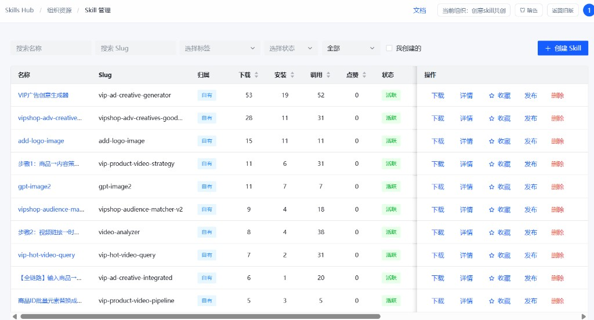
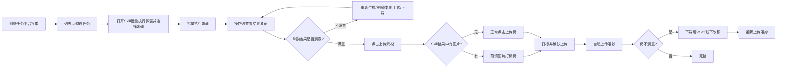
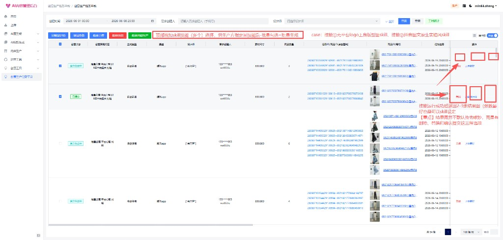
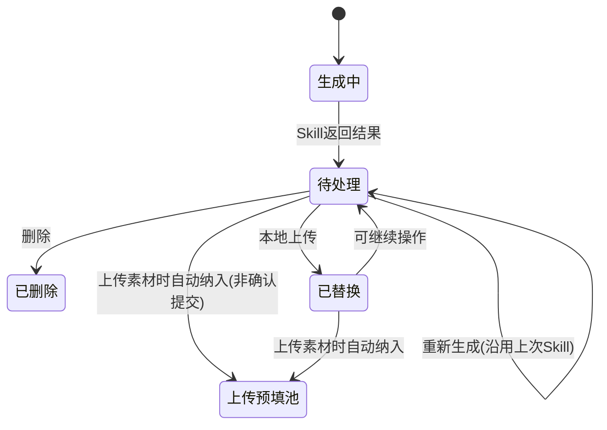
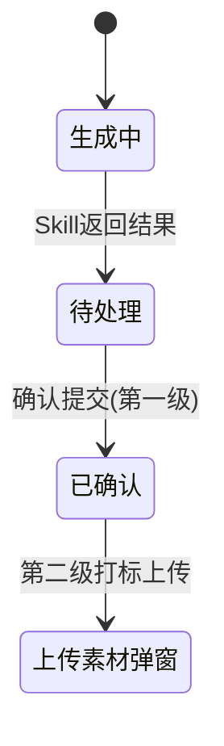
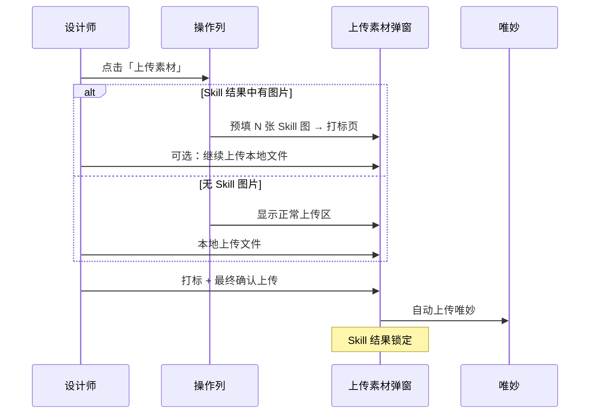

# 产品迭代需求：AI 生产平台 Skill 批量应用

| 项目 | 内容 |
|------|------|
| 文档版本 | v1.3 |
| 创建日期 | 2026-06-08 |
| 最近更新 | 2026-06-09（对齐前端原型实现；补充故事版 Skill、上传弱耦合、差异对照） |
| 需求类型 | 产品迭代 |
| 涉及系统 | 创意任务平台 → AI 生产平台 → 唯妙创意 |
| 本期范围 | 以**平面生成 Skill**为主；**实拍视频 / 故事版 Skill** 已在原型中试点（见 §11） |
| 改造方式 | **现有「创意生产平台」任务列表页增量改造** |
| 原型状态 | 静态 HTML 原型可本地预览；后端接口未对接，使用 Mock（见 §10.8.3、§11） |

---

## 一、背景

广告创意策略团队已基于业务侧需求，结合 AI 侧提供的基础 Skill，开发了适配**广告外投场景**的平面生成、视频生成 Skill，并已在部分场景开放使用。

**当前使用情况：**

- Skill 已开放给设计师及少量投放同学，在 **Valet** 上使用
- Valet 因**服务器不稳定**，更适用于**少数、灵活生产**的场景，**不适用于大批量生产**

**现有业务链路：**

选品 → 下单 → 创意生产，已基本在以下平台形成闭环：

```
广告创意平台 → AI 生产平台 → 唯妙创意
```

**参考示意图（Skills Hub - Skill 管理）：**



> 广告创意策略团队已在 Skills Hub 沉淀平面/视频生成等 Skill（如 VIP 广告创意生成器、抖音图文原生实拍风等），本期需在 AI 生产平台侧支持批量调用。

---

## 二、目标

在**不改造 Valet 大批量生产能力**的前提下，将 Skill 的批量应用能力接入 **AI 生产平台**，承接创意任务平台已有接单链路，实现：

1. **批量调用 Skill 生产**，替代 Valet 在大批量场景下的使用
2. **成品集中展示与筛选**，供设计师挑选、确认
3. **单张结果图不满意可重新生成**，无需 Prompt 交互
4. **确认后走现有上传唯妙链路**；仍不满意则支持下载后线下/Valet 调整再上传

### 本期不做

| 不做项 | 说明 |
|--------|------|
| Prompt 交互 | AI 生产平台不提供 Prompt 编辑/调试能力 |
| 设计师深度改稿 | 设计师对成品的精细调整，仍通过 **Valet** 或线下工具完成 |
| Valet 稳定性改造 | 不在本期范围内 |
| 图创作 | **取消**现有「图创作」入口与交互 |
| 新建独立页面 | 不做单独 Skill 生产页，仅在现有列表页增量改造 |

---

## 三、目标链路

### 3.1 主流程（理想态）



### 3.2 流程说明

| 步骤 | 环节 | 说明 | 是否新建 |
|------|------|------|----------|
| 1 | 创意任务平台接单 | 沿用现有选品-下单-任务分配链路 | 现有 |
| 2 | 批量执行 Skill | 列表页顶部选 Skill，勾选任务后批量调用 | **新建** |
| 3 | 结果弹窗处理 | 每任务 N 张结果（图或故事版文件），每张独立操作 | **新建** |
| 4 | 单张重新生成 | 不满意结果替换，沿用上次 Skill | **新建** |
| 5 | 上传素材 + 打标 | 与 Skill **弱耦合**：有图则预填打标，无图则正常上传 | 现有（规则调整，见 §10.6） |
| 6 | 自动上传唯妙 | 弹窗内最终确认后自动上传 | 现有 |
| 7 | 下载 + 线下改稿 | 仍不满意，下载后在 Valet/线下调整 | 现有 |

### 3.3 工程边界（本期最小可行范围）

> **AI 生产平台本期仅需支持：批量调用 Skill、展现成品、单张重新调用 Skill、结果弹窗三态操作。**

任务接单、标签弹窗、唯妙上传、线下改稿均复用现有能力。

---

## 四、平面生成需求（本期）

### 4.1 页面参考



**示意图标注说明：**

| 标注位置 | 需求说明 |
|----------|----------|
| 页面顶部 | 增加 Skill 下拉（单选），支持先勾选任务再选 Skill |
| Skill 示例 | 技能① 大平台 logo 上身版型鉴 skill；技能② 抖音图文原生实拍风 skill |
| 操作列 | 「关闭」右侧内联 loading 或「查看结果」；弹窗内展示 N 张结果 |
| 结果图操作 | **不默认传唯妙**；图片：下载 / 删除 / 本地上传 / 重新生成 |
| 上传素材 | 保留按钮；**有 Skill 图片则预填打标**，否则显示正常上传区 |

> 详细交互规则见 **第十章**。

### 4.2 功能需求摘要

| 模块 | 要点 | 详见 |
|------|------|------|
| Skill 区 | 顶部下拉单选；按渠道/生成类型过滤；可先勾选任务再选 Skill | §10.2、§10.3 |
| 批量执行 | 与「批量开始生产」分离；仅多选「生成中」任务时出现 | §10.4 |
| 结果处理 | 操作列入口 + 弹窗；每张图三按钮；不默认传唯妙 | §10.5、§10.6 |
| 重新生成 | 单张替换；沿用上次 Skill；确认提交前均可操作 | §10.7 |
| 上传唯妙 | 上传素材（弱耦合 Skill）→ 标签弹窗 → 确认后自动上传 | §10.6 |
| 故事版 Skill | 实拍视频场景返回 Excel 分镜表，可下载，不进上传素材池 | §10.9 |

---

## 五、用户角色与场景

| 角色 | 典型场景 | Skill 批量权限 |
|------|----------|----------------|
| UED 设计师 | 批量 Skill 生产、结果筛选、上传打标 | ✅ 有 |
| 已分配 OA 设计师 | 同上 | ✅ 有 |
| AIGC 设计师 | 不参与 Skill 批量生产 | ❌ 无 |
| 广告创意策略团队 | 在 Skills Hub 维护 Skill | 管理端，非生产端 |

---

## 六、非功能需求

| 类别 | 要求 |
|------|------|
| 批量性能 | 支持单次批量勾选不少于 **50 条**任务（阈值待技术评估） |
| 异步生成 | **生成中可离开页面**；任务级 loading 持续到 N 张图全部返回 |
| 稳定性 | 批量生产需有任务队列、失败重试 |
| 可追溯 | 记录 Skill 名称/slug、生成时间、操作人、单张图状态 |
| 权限 | 仅非 AIGC 设计师可见「批量执行 Skill」 |

---

## 七、验收标准

### 7.1 已对齐原型（待联调后正式验收）

- [x] 列表页批量操作区增加「Skill 批量执行」按钮（与「批量开始生产」独立）
- [x] 勾选 ≥1 条「生成中」非 AIGC 任务时可打开 Skill 批量执行弹窗
- [x] 弹窗内支持渠道 / 生成类型 / Skill 三级筛选；不匹配 Skill 隐藏
- [x] 一次批量仅使用一个 Skill；可先勾选任务再选 Skill
- [x] AIGC 设计师不展示 Skill 批量相关操作
- [x] 已触发 Skill 的任务，操作列内联 loading 或「查看结果」（紧挨「关闭」）
- [x] 结果弹窗展示 N 张结果；图片支持下载 / 删除 / 本地上传 / 重新生成
- [x] 单张重新生成沿用上次 Skill；上传唯妙前均可操作（上传后锁定）
- [x] 结果不默认上传唯妙
- [x] 「上传素材」与 Skill **弱耦合**：有图片预填打标，无图片走正常上传
- [x] 打标弹窗支持「继续上传」追加本地文件；打标交互与现网一致
- [x] 标签弹窗最终确认后自动上传唯妙；上传后 Skill 结果锁定
- [x] 「生成中」状态已取消「图创作」；Skill 未全部返回时操作列显示 loading
- [x] 故事版 Skill 返回 Excel，可下载，不进入上传素材池

### 7.2 待产品确认 / 待后端联调

- [ ] Skill 筛选区是否迁回列表页顶部常驻（当前在批量执行弹窗内）
- [ ] 是否恢复「N 张待处理」文案及两级「确认提交」预选机制（原型已简化，见 §9、§11.2）
- [ ] 批量执行最低勾选条数：≥1（原型）还是 ≥2（v1.2 原稿）
- [ ] 故事版 Excel 上传唯妙的正式链路（本期原型仅下载）
- [ ] Skills Hub 映射接口联调（§10.8）
- [ ] 批量并发、超时、失败重试策略（§6）

---

## 八、后续规划（本期不含）

| 模块 | 说明 |
|------|------|
| 视频生成 Skill | 链路同平面，待平面能力验证后迭代 |
| Skills Hub 映射完整方案 | 本期预留接口与字段，方案见 §10.8 待补充 |
| Prompt 能力 | 不在 AI 生产平台提供，继续由 Valet 承担 |

---

## 九、待确认事项

| # | 事项 | 状态 |
|---|------|------|
| 1 | 单图「确认提交」与「上传素材 → 打标 → 确认上传」是否合并为一步 | **原型已简化**：取消第一级「确认提交」，待处理图可直接进入上传预填池；**需产品复核是否回退两级方案** |
| 2 | 「删除」是否需二次确认；删除后是否可恢复 | 待确认（原型：无二次确认，不可恢复） |
| 3 | 批量生产并发上限、单 Skill 超时与失败重试策略 | 待技术评估 |
| 4 | 每任务结果张数 N 是否由 Skill 配置下发 | **倾向 Skill 配置**（原型 `outputCount` 字段已预留） |
| 5 | 视频 / 故事版 Skill 排期与上传唯妙链路 | **故事版已在原型试点**；Excel 如何进唯妙待定义 |
| 6 | 上传素材与 Skill 的耦合强度 | **原型：弱耦合**——不阻断本地上传；有图预填、无图 dropzone（见 §10.6.2） |
| 7 | Skill 批量最低勾选条数 | 原型 ≥1；v1.2 原稿 ≥2，**待统一** |
| 8 | Skill 筛选 UI 位置 | 原型在弹窗内；v1.2 原稿在列表页顶部，**待统一** |
| 9 | 纯 Skill 图上传时是否校验 `materialQuantity` | 原型：全为 Skill 图时跳过数量校验；混传本地文件时仍校验 |
| 10 | 上传唯妙后 Skill 结果是否永久锁定 | 原型：是；重新上传流程待产品定义 |

---

## 十、交互与状态定义（已确认）

### 10.1 页面改造范围

| 项 | 决策 | 原型实现 |
|----|------|----------|
| 改造方式 | 在现有「创意生产平台」**任务列表页**上**增量改造**，不新建独立页面 | ✅ |
| Skill 入口 | 列表页**批量操作区**「Skill 批量执行」按钮 | ✅ 弹窗内含筛选 + 选 Skill |
| Skill 区位置（备选） | 列表页顶部常驻 `[渠道][生成类型][Skill]` | ⏳ 未实现，见 §9-8 |
| 操作列 | 按任务状态及是否已触发 Skill 切换 | ✅ 内联「查看结果」/ loading |
| 列设置 | — | ✅ 固定列表头最右侧 |
| 取消功能 | 移除「图创作」按钮及相关交互 | ✅ |

### 10.2 Skill 选择交互

| 项 | 决策 |
|----|------|
| 选择顺序 | **可先勾选任务，再选择 Skill**（无强制先选 Skill） |
| 选择方式 | 顶部 **下拉单选**，从多个 Skill 中选一个 |
| 批量约束 | **一次批量只能使用一个 Skill** |
| 列表过滤 | Skill 列表按任务的 **渠道 / 生成类型** 过滤；带**默认筛选项** |
| 不匹配处理 | 与当前筛选条件不匹配的 Skill **隐藏**（不展示置灰项） |

**Skill 批量执行弹窗示意（原型）：**

```
┌─ Skill 批量执行 ─────────────────────────┐
│ 已勾选 N 条，其中 M 条可执行 Skill        │
│ [ 渠道 ▼ ] [ 生成类型 ▼ ] [ 选择 Skill ▼ ]│
│ [ 取消 ]              [ 确认执行 ]        │
└──────────────────────────────────────────┘
```

**列表页顶部常驻示意（v1.2 原稿，待产品确认是否恢复）：**

```
[ 渠道 ▼ ] [ 生成类型 ▼ ] [ 选择 Skill ▼ ]     [ 批量执行 Skill ]（条件显示）
```

### 10.3 批量按钮与权限

| 按钮 | 说明 | 显示条件 |
|------|------|----------|
| **批量开始生产** | **现有能力**，与 Skill 无关 | 沿用现网规则 |
| **Skill 批量执行** | **新建**，打开弹窗选择 Skill 并批量调用 | 同时满足：① 已勾选 **≥1 条**任务（原型；v1.2 原稿为 ≥2，见 §9-7）；② 勾选任务中存在 **「生成中」** 的非 AIGC 任务；③ 当前用户为 **非 AIGC** |

**权限说明：**

- ✅ UED、已分配 OA 设计师：可使用 Skill 批量相关能力
- ❌ AIGC 设计师：不展示「批量执行 Skill」及 Skill 结果处理入口

### 10.4 操作列状态机

#### 10.4.1 总览

| 任务状态 | 设计师类型 | 操作列展示 |
|----------|------------|------------|
| 待分配设计师 | - | 分配设计师、导出任务（现网） |
| 待生产 / 重新待生产 | 非 AIGC | 开始生产、关闭（现网） |
| **生成中** | 非 AIGC | **上传素材**、**关闭**；若已触发 Skill → **「关闭」右侧**内联 loading 或 **「查看结果」** |
| **生成中** | AIGC | 无 Skill 相关操作（现网） |
| 已上传 / 已完成等 | - | 沿用现网 |

> **「生成中」状态已取消「图创作」。** 操作列**不展示**素材名称、**不展示**「N 张待处理」独立文案（v1.2 原稿有，原型已简化）。

#### 10.4.2 Skill 结果入口

- **未触发 Skill**：操作列仅「上传素材」「关闭」
- **已触发 Skill 批量生成**：
  - **生成中**（仍有结果未返回）：「关闭」右侧显示 **loading 图标**
  - **全部返回或部分可查看**：显示 **「查看结果」** 文字按钮（`btn-link` 样式）
  - 点击 → 打开 **结果处理弹窗**
  - ~~「N 张待处理」文案~~（v1.2 原稿；原型未实现，待产品确认是否恢复）

#### 10.4.3 任务级 loading 规则

| 项 | 规则 |
|----|------|
| 页面离开 | **生成中允许离开页面**（异步任务） |
| 外部状态 | 若 N 张素材中 **任意一张尚未返回结果**，任务对外的创意状态保持 **loading（生成中）** |
| 全部返回 | N 张全部返回后，loading 结束，进入结果待处理态 |

### 10.5 结果处理弹窗

#### 10.5.1 展示规则

- 每任务展示 **2～3 张结果图**（张数由 Skill 配置，见待确认 §9-4）
- **不默认上传唯妙**
- 弹窗内以卡片/网格展示，**每张图独立操作**

#### 10.5.2 单张结果操作（原型）

**图片类结果：**

| 操作 | 说明 |
|------|------|
| **下载** | 下载单张结果图到本地 |
| **删除** | 舍弃该张结果（无二次确认） |
| **本地上传** | 上传本地图片，**替换**该张 AI 结果 |
| **重新生成** | 单张再次调用 Skill，沿用任务级 Skill |

**故事版类结果（`resultType: storyboard`）：**

| 操作 | 说明 |
|------|------|
| **下载故事版 Excel** | 下载分镜表文件（不进上传素材池） |
| **删除** | 舍弃该条故事版结果 |
| **重新生成** | 重新生成故事版文件 |

> **v1.2 原稿**含第一级「确认提交」；**原型已移除**，待处理 / 已替换状态的图片可直接被「上传素材」预填（见 §10.6.2、§11.2）。

#### 10.5.3 单张图状态机（原型简化版）



**v1.2 原稿状态机（含「已确认」，待产品确认是否恢复）：**



#### 10.5.4 重新生成规则

| 项 | 规则 |
|----|------|
| 触发粒度 | **单张图**重新生成，用于替换不满意的结果 |
| 时间窗口 | 在任务**最终完成上传唯妙之前**，所有图均可：重新生成 / 删除 / 本地上传 |
| Skill | **沿用该任务上次执行的 Skill**，不可在单张重生成时更换 Skill |
| 与删除区别 | 删除 = 放弃该张；重新生成 = 再次调用 Skill 产出新图替换 |

### 10.6 上传素材与唯妙链路

#### 10.6.1 v1.2 原稿：两级确认（待产品复核）

v1.2 曾约定 **两级确认**：

| 级别 | 入口 | 作用 | 是否上传唯妙 |
|------|------|------|--------------|
| **第一级** | 结果弹窗 →「确认提交」 | 预选纳入待上传素材池 | ❌ 否 |
| **第二级** |「上传素材」→ 打标 → 确认上传 | 打标并上传唯妙 | ✅ 是 |

> **原型当前未实现第一级「确认提交」**，见 §10.6.2。是否恢复两级方案列入 §9-1 待确认。

#### 10.6.2 上传素材与 Skill 弱耦合（原型已实现）

**核心原则：**「上传素材」**不强制依赖** Skill 执行状态或 Skill 结果；始终可打开上传弹窗。

| 场景 | 上传弹窗行为 |
|------|--------------|
| 无 Skill / Skill 生成中 / 仅故事版 Excel | 显示**正常点击上传区**（dropzone），用户本地上传 |
| Skill 有**图片**结果（`pending` / `replaced` / `confirmed`，非故事版） | **预填图片打标页**；支持「继续上传」追加本地文件 |
| 已上传唯妙（Skill 结果已锁定） | **阻断**再次打开上传弹窗，提示走重新上传流程 |

**预填规则（`getSkillImageMaterials`）：**

- 纳入状态：`pending`、`replaced`、`confirmed`（有 `url` 的图片）
- **排除**：`deleted`、`generating`、故事版（`resultType: storyboard`）、`.xlsx` 等非图片
- **不等待** Skill 全部生成完毕即可预填已返回的图片
- **不阻断** Skill 生成中时本地上传

**打标与上传：**

- 打标交互与现网一致（标签编辑、批量解析等）
- 最终确认后自动上传唯妙，并 **锁定** Skill 结果（不可再编辑）
- 素材数量校验：全部为 Skill 预填图时可跳过 `materialQuantity` 校验；混有本地上传时仍校验



| 项 | 决策（原型） |
|----|--------------|
| 上传入口 | 操作列保留 **「上传素材」** |
| 与 Skill 关系 | **弱耦合**：有图预填，无图正常上传 |
| 打标流程 | 与现网一致；预填场景可继续追加本地素材 |
| 唯妙上传 | 弹窗内最终确认后自动上传 |
| 上传后 | Skill 结果锁定，结果弹窗只读（可下载） |

### 10.7 数据模型（前端参考）

```typescript
// Skill 元数据（列表 / 筛选）
interface SkillMeta {
  slug: string;
  name: string;
  channels: string[];           // 字节 | 腾讯 | 小红书
  generationTypes: string[];    // 单品单图 | 实拍视频
  outputCount: number;          // 每任务返回条数 N
  resultType?: 'image' | 'storyboard';  // 默认 image
}

// 任务渠道映射（任务字段 → Skill 筛选）
// 抖音/douyin → 字节；微信/VTD → 腾讯
// 单品单视频/单品多视频 → 实拍视频

// 任务级
interface TaskSkillContext {
  taskId: string;
  skillSlug: string;
  skillName: string;
  expectedResultCount: number;
  triggeredAt: string;
  locked?: boolean;             // 上传唯妙后 true
  results: SkillResult[];
}

// 单条 Skill 结果（图或故事版）
interface SkillResult {
  id: string;
  url: string;
  status: 'generating' | 'pending' | 'deleted' | 'replaced' | 'confirmed';
  source: 'skill' | 'local';
  resultType?: 'image' | 'storyboard';
  fileName?: string;            // 故事版 Excel 文件名
  updatedAt: string;
}
```

### 10.8 Skills Hub → 生产平台映射（待补充）

> **本节预留，供后续与 Skills Hub / 后端联调前补齐。**

#### 10.8.1 待定义字段映射

| Skills Hub 字段 | 生产平台用途 | 映射规则（待补充） |
|-----------------|--------------|-------------------|
| `slug` | Skill 唯一标识、批量调用入参 | _待后端接口定义_ |
| `name` | 下拉展示名称 | _待补充_ |
| `status`（活跃/停用） | 是否出现在下拉列表 | 仅 `活跃` 可展示 |
| 组织权限 | 当前用户可见 Skill 范围 | _待补充：组织 ID / 角色 / 白名单_ |
| 标签 / 元数据 | 渠道、生成类型过滤 | _待补充：Skill 适用渠道、适用生成类型字段_ |
| `outputCount` | 每任务返回图张数 N | _待补充：是否由 Skill 配置下发_ |

#### 10.8.2 待定义接口（预留）

```
GET /api/skills?channel={}&generationType={}&orgId={}
  → 返回当前用户可用、状态活跃、与筛选匹配的 Skill 列表

POST /api/skill/batch-execute
  body: { skillSlug, taskIds[] }
  → 异步触发批量生成

GET /api/tasks/{taskId}/skill-results
  → 返回该任务 N 张结果图及状态

POST /api/tasks/{taskId}/skill-results/{resultId}/regenerate
  → 单张重新生成（沿用 task 级 skillSlug）

POST /api/tasks/{taskId}/skill-results/{resultId}
  → 删除 / 本地上传替换 / 确认提交
```

#### 10.8.3 前端 Mock 策略（开发阶段）

在 §10.8 接口未就绪前，前端使用本地 Mock（`skill-module.js`）：

| Mock Skill | slug | 渠道 | 生成类型 | 输出 |
|------------|------|------|----------|------|
| 大平台logo上身版型鉴 | `vip-logo-fit` | 字节、腾讯 | 单品单图 | 3 张图 |
| 抖音图文原生实拍风 | `douyin-native` | 字节、小红书 | 单品单图 | 2 张图 |
| 实拍视频快剪 | `live-video-cut` | 全渠道 | 实拍视频 | 2 张图 |
| VIP广告创意生成器 | `vip-ad-creative` | 全渠道 | 单品单图、实拍视频 | 2 张图 |
| 生成故事版skill | `storyboard-gen` | 全渠道 | 实拍视频 | 1 个 Excel |

- 接口：`GET /api/skills` 失败时回退 Mock
- 批量执行：模拟异步，逐条返回结果（故事版返回 `assets/files/分镜表汇总.xlsx`）
- 页面刷新后 `skillContext` **不持久化**（仅内存 Mock）

#### 10.8.4 原型测试数据（`script.js`）

| 任务 ID | 用途 |
|---------|------|
| `7CrNkAAJ` / `7CrNkAAL` | 单品单图 Skill 批量测试 |
| `7CrNkAAM` / `7CrNkAAN` | 实拍视频 + 故事版 Skill 测试 |

---

### 10.9 故事版 Skill（原型试点）

| 项 | 说明 |
|----|------|
| 适用场景 | **实拍视频**类任务（`templateCategory` / 生成类型映射为「实拍视频」） |
| 结果形态 | Excel 分镜表（非图片），`resultType: storyboard` |
| 弹窗展示 | Excel 卡片样式，点击可下载 |
| 与上传关系 | **不进入**上传素材预填池；用户需走正常上传或线下流程 |
| 操作 | 下载故事版 Excel、删除、重新生成 |
| 待定义 | 故事版 Excel 如何同步至唯妙 / 视频生产下游系统 |

---

## 十一、原型实现差异对照与 PRD 欠缺信息

> 本节供产品 / 研发人工接续优化时对照。最后同步原型日期：**2026-06-09**。

### 11.1 已实现 vs v1.2 原稿差异总表

| 维度 | v1.2 原稿 | 当前原型 | 建议后续动作 |
|------|-----------|----------|--------------|
| Skill 筛选 UI | 列表页顶部常驻 | 批量执行**弹窗内** | 产品定稿 UI 位置 |
| 批量最低条数 | ≥2 条 | ≥1 条 | 统一门槛 |
| 操作列 Skill 入口 | 「N 张待处理」+ 查看结果 | loading /「查看结果」内联 | 是否恢复计数文案 |
| 结果预选 | 第一级「确认提交」 | **已移除**；待处理图直接可预填 | **重点待确认** §9-1 |
| 上传与 Skill | 须先有确认图才可上传 | **弱耦合**，随时可上传 | 已写入 §10.6.2 |
| 结果操作 | 删除/本地上传/确认提交 | 下载/删除/本地上传/重新生成 | 确认提交是否回归 |
| 故事版 Skill | 本期不含 | **已试点** | 定义唯妙/下游链路 |
| 后端接口 | 预留 | 全 Mock | 联调 §10.8 |
| 异步持久化 | 生成中可离开页面 | 刷新丢失 skillContext | 需后端任务状态 |
| 删除二次确认 | 待确认 | 无 | 产品决策 |
| 失败重试 / 队列 | §6 要求 | Mock 无失败态 | 技术方案 |

### 11.2 本次改动说明（上传弱耦合，2026-06-09）

**改动文件：** `script.js`（`openUploadModal`）、`skill-module.js`（`getConfirmedSkillMaterials`）

**行为变化：**

1. 移除「Skill 生成中不可上传」「无 Skill 素材不可上传」拦截
2. `getConfirmedSkillMaterials` 仅收集**图片类** Skill 结果，排除故事版 Excel
3. 有图 → 打标页预填 + 可继续上传；无图 → dropzone
4. 不再使用 `skillMode` 锁定上传来源（用户可混传本地文件）

### 11.3 PRD 仍欠缺、需产品补充的信息

| 类别 | 欠缺内容 | 影响 |
|------|----------|------|
| **交互定稿** | 两级确认 vs 弱耦合上传的最终方案 | 前后端状态机、按钮文案 |
| **故事版链路** | Excel 产出后的交付物：是否上传唯妙、字段映射、与视频任务关联 | 故事版 Skill 能否正式上线 |
| **结果类型扩展** | 除 `image` / `storyboard` 外是否还有视频缩略图、多文件 ZIP 等 | 数据模型与弹窗 UI |
| **权限细粒度** | UED vs OA 设计师是否共用全部 Skill；组织级白名单规则 | Skills Hub 映射 §10.8 |
| **渠道映射表** | 任务 `channel` 全量枚举与 Skill `channels` 对齐表 | 筛选准确性 |
| **生成类型映射** | `templateCategory` / `generationType` 与 Skill 类型的完整映射 | 实拍视频、多图等场景 |
| **素材数量** | Skill 产出张数与任务 `materialQuantity` 不一致时的规则 | 上传校验、提示文案 |
| **锁定与重传** | 上传唯妙后修改 Skill 结果、重新上传的正式流程 | `isSkillResultsLocked` 产品化 |
| **异常态** | 单张生成失败、超时、部分成功 UI 与重试入口 | 设计师操作体验 |
| **审计日志** | Skill 调用、单张操作、上传唯妙的埋点字段 | §6 可追溯性 |
| **性能指标** | 50 条批量下的 SLA、并发、排队提示 | 验收标准量化 |
| **AIGC 边界** | AIGC 任务是否永远不可执行 Skill；混合勾选提示文案 | 权限验收 |
| **子任务** | 子任务上传与 Skill 结果是否关联 | 多素材任务场景 |

### 11.4 建议人工接续优化优先级

1. **P0** — 确认 §9-1：是否恢复「确认提交」两级方案，或维持弱耦合 + 无预选
2. **P0** — 故事版 Excel 下游链路（§10.9）
3. **P1** — Skill 筛选 UI 位置、批量条数门槛统一
4. **P1** — §10.8 接口字段与 Skills Hub 对齐
5. **P2** — 异常态、删除确认、操作列「N 张待处理」文案
6. **P2** — 持久化、审计、性能指标写入 §6 / §7

---

## 附录 A：名词说明

| 名词 | 说明 |
|------|------|
| Skill | 广告创意策略团队基于业务需求封装的 AI 生成能力包（含平面/视频） |
| Skills Hub | Skill 注册、发布、权限管理后台 |
| slug | Skill 在 Skills Hub 中的唯一技术标识 |
| Valet | 设计师进行 Prompt 交互与灵活生产的工具 |
| AI 生产平台 | 承接创意任务的生产平台，本期改造「创意生产平台」列表页 |
| 唯妙创意 | 创意素材最终投放/管理端 |
| 批量执行 Skill | 对多条「生成中」任务，使用所选 Skill 异步批量生成结果图 |
| 批量开始生产 | **现有**批量生产能力，与 Skill 批量执行无关 |
| 确认提交（第一级，v1.2 原稿） | 单张结果预选；**原型已移除**，待产品复核 |
| 确认上传 | 上传素材弹窗内最终确认，自动上传唯妙 |
| 弱耦合上传 | 上传素材不强制依赖 Skill；有图预填、无图本地上传 |
| 故事版 Skill | 返回 Excel 分镜表的 Skill，不进图片上传池 |
| Skill 结果锁定 | 上传唯妙后结果只读，不可删除/替换/重生成 |
| 生产方 | UED 或已分配 OA 设计师（非 AIGC） |

## 附录 B：文案规范

| 场景 | 统一文案 | 备注 |
|------|----------|------|
| 批量 Skill 按钮 | Skill 批量执行 | 原型文案 |
| 批量弹窗标题 | Skill 批量执行 | |
| Skill 选择 | 选择 Skill | 在弹窗内 |
| 结果入口 | 查看结果 | 原型无「N 张待处理」 |
| 生成中态 | loading 图标 | 无独立文案 |
| 图片单张操作 | 下载、删除、本地上传、重新生成 | |
| 故事版操作 | 下载故事版 Excel、删除、重新生成 | |
| 上传入口 | 上传素材 | 有图进打标，无图进上传区 |
| 打标页标题 | 图片打标 | 有预填素材时 |
| 取消功能 | 不再展示「图创作」 | |
| 待确认（v1.2） | 确认提交 | 是否恢复见 §9-1 |
